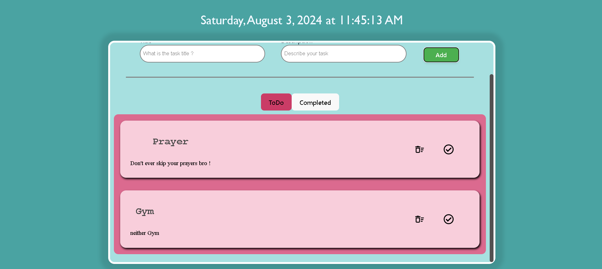

---

# [ToDoApp](https://github.com/NourMontacer01/ToDoApp)

---

## Developer Portfolio

### Welcome to my ToDoApp project! This application is designed to help users manage their tasks effectively and efficiently. It’s built using modern technologies to ensure a smooth user experience.

---

# Demo :movie_camera:



---

## Table of Contents :scroll:

- [Technologies Used](#technologies-used-package)
- [Installation](#installation-arrow_down)
- [Getting Started](#getting-started-dart)
- [Usage](#usage-joystick)
- [Personal Information](#personal-information)
- [Contributing](#contributing)
- [License](#license)

---

# Technologies Used :package:

- **React:** Version 17
- **Vite:** A modern build tool that provides fast development and build times.

---

# Installation :arrow_down:

### You will need to download Git and Node to run this project
#### Make sure you have the latest version of both Git and Node on your computer.

- [Git](https://git-scm.com/downloads)
- [Node](https://nodejs.org/en/download/)

---

# Getting Started :dart:

### Fork and Clone the repo

To Fork the repo click on the fork button at the top right of the page. Once the repo is forked open your terminal and perform the following commands:

git clone https://github.com/NourMontacer01/ToDoApp.git

cd ToDoApp


### Install packages from the root directory

```bash
npm install
# or
yarn install

Then, run the development server:

npm run dev
# or
yarn dev

Open http://localhost:3000 with your browser to see the result.

javascript
export const personalData = {
  name: "Nour Montacer",
  profile: '/profile.png',
  logo:'/profile.png',
  designation: "Software Developer",
  description: "My name is Nour Montacer. I am a professional and enthusiastic programmer in my daily life. I am a quick learner with a self-learning attitude. I love to learn and explore new technologies and am passionate about problem-solving. I love almost all the stacks of web application development and love to make the web more open to the world. My core skill is based on JavaScript and I love to do most of the things using JavaScript. I am available for any kind of job opportunity that suits my skills and interests.",
  email: 'nourmontacer10@gmail.com',
  phone: '+216 28 703 886',
  address: 'Sousse, Tunisia',
  github: 'https://github.com/NourMontacer01',
  facebook: 'https://www.facebook.com/nour.montacer.52/',
  linkedIn: 'https://www.linkedin.com/in/10montacer10nour10/',
  twitter: 'https://x.com/nourmontacer',
  stackOverflow: 'https://stackoverflow.com/users/25710770/montacer01-nour',
  leetcode: "https://leetcode.com/u/Nourmontacer01/",
  devUsername: "Nour Montacer",
  resume: "https://drive.google.com/file/d/1WE3euELEj8lHloOLeAdszPyneJuy1eYX/view?usp=drive_open"
}
